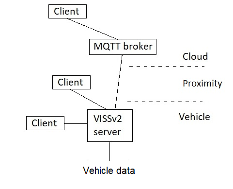

**https://www.w3.org/TR/security-privacy-questionnaire/**

## What information might this feature expose to Web sites or other parties, and for what purposes is that exposure necessary?

User Agents should only expose information to the web when doing so is
necessary to serve a clear user need. Does your feature expose
information to origins? If so, how does exposing this information serve
user needs? Are the risks to the user outweighed by the benefits to the
user? If so, how?

See also [Web Platform Design Principles § priority-of-constituencies](https://www.w3.org/TR/design-principles/#priority-of-constituencies)

When answering this question, please consider each of these four
possible areas of information disclosure / sharing.

For the below sub-questions, please take the term *potentially
identifying information* to mean information that describes the browser
user, distinct from others who use the same browser version. Examples of
such *potentially identifying information* include information about the
browser user's environment (e.g., operating system configuration,
browser configuration, hardware capabilities), and the user's prior
activities and interests (e.g., browsing history, purchasing
preferences, personal characteristics).

1.  What information does your spec expose to the **first party** that the **first party** cannot currently easily determine.

2.  What information does your spec expose to **third parties** that **third parties** cannot currently easily determine.

3.  What *potentially identifying information* does your spec expose to the **first party** that the **first party** can already access (i.e., what identifying information does your spec duplicate or mirror).

4.  What *potentially identifying information* does your spec expose to **third parties** that **third parties** can already access.

**Answer:**

This spec can be used to expose vehicle data to a user that can either
be in the vehicle, in proximity of the vehicle, or remote to the
vehicle, see figure below.

The API defined by the spec is implemented in the vehicle server, a user
(client) accessing this API may use a native app developed for this
purpose, or a web browser.

The spec mandates the use of TLV v1.2, it also provides an optional
access control solution using JSON Web tokens(, as well as an optional
user consent solution that relies on an out-of-spec framework that
obtains the consent decision by the user).

The spec does not require any user agent information to be provided to
the server implementing the API as the vehicle data being returned to
the user is agnostic to such information and is delivered in a fixed
format to all users.

## Do features in your specification expose the minimum amount of information necessary to enable their intended uses?

Features should only expose information when it's absolutely necessary
to satisfy use cases. If a feature exposes more information than is
necessary, why does it do so?

**Answer:**

A user request for vehicle data must specify exactly what vehicle data
is requested, and the spec mandates that the response shall contain
exactly this and no more.

See also [§ 4.1 Data Minimization](https://www.w3.org/TR/security-privacy-questionnaire/#data-minimization)

Content Security
Policy [\[CSP\]](https://www.w3.org/TR/security-privacy-questionnaire/#biblio-csp) unintentionally
exposed redirect targets cross-origin by allowing one origin to infer
details about another origin through violation reports
(see [\[HOMAKOV\]](https://www.w3.org/TR/security-privacy-questionnaire/#biblio-homakov)).
The working group eventually mitigated the risk by reducing a policy's
granularity after a redirect.

## How do the features in your specification deal with personal information, personally-identifiable information (PII), or information derived from them?

**Answer:**

As mentioned in a previous answer, the spec contains optional access
control and consent features that an implementor can apply to any
vehicle data, including to PII data. The access control model requires
the user to specify a purpose in order to obtain the token that is
needed for access to be granted.

Personal information is any data about a user (for example, their home
address), or information that could be used to identify a user, such as
an alias, email address, or identification number.

Note: Personal information is distinct from personally identifiable
information (PII). PII is a legal concept, the definition of which
varies from jurisdiction to jurisdiction. When used in a non-legal
context, PII tends to refer generally to information that could be used
to identify a user.

When exposing personal information, PII, or derivative information, spec
authors must take steps to minimize the potential harm to users.

A feature which gathers biometric data (such as fingerprints or retina
scans) for authentication should not directly expose this biometric data
to the web. Instead, it can use the biometric data to look up or
generate some temporary key which is not shared across origins which can
then be safely exposed to the
origin. [WEBAUTHN](https://www.w3.org/TR/security-privacy-questionnaire/#biblio-webauthn)

Personal information, PII, or their derivatives should not be exposed to
origins without [meaningful user
consent](https://w3ctag.github.io/design-principles/#consent).
Many APIs use the Permissions API to acquire meaningful user
consent. [\[PERMISSIONS\]](https://www.w3.org/TR/security-privacy-questionnaire/#biblio-permissions)

Keep in mind that each permission prompt added to the web platform
increases the risk that users will ignore the contents of all permission
prompts. Before adding a permission prompt, consider your options for
using a less obtrusive way to gain meaningful user
consent. [\[ADDING-PERMISSION\]](https://www.w3.org/TR/security-privacy-questionnaire/#biblio-adding-permission)

\<input type=file\> can be used to upload documents containing personal
information to websites. It makes use of the underlying native
platform's file picker to ensure the user understands that the file and
its contents will be exposed to the website, without a separate
permissions prompt.

See also

-   [§ 4.3 Explicit user mediation](https://www.w3.org/TR/security-privacy-questionnaire/#user-mediation)

-   [Web Platform Design Principles § consent](https://www.w3.org/TR/design-principles/#consent)

  ## How do the features in your specification deal with sensitive information?

**Answer:**

As mentioned in earlier answers, the spec provides optional access
control and consent features that an implementor can use to deal with
the vehicle data, including sensitive information.

Personal information is not the only kind of sensitive information. Many
other kinds of information may also be sensitive. What is or isn't
sensitive information can vary from person to person or from place to
place. Information that would be harmless if known about one person or
group of people could be dangerous if known about another person or
group. Information about a person that would be harmless in one country
might be used in another country to detain, kidnap, or imprison them.

Examples of sensitive information include: caste, citizenship, color,
credentials, criminal record, demographic information, disability
status, employment status, ethnicity, financial information, health
information, location data, marital status, political beliefs,
profession, race, religious beliefs or nonbeliefs, sexual preferences,
and trans status.

When a feature exposes sensitive information to the web, its designers
must take steps to mitigate the risk of exposing the information.

The Credential Management API allows sites to request a user's
credentials from a password
manager. [\[CREDENTIAL-MANAGEMENT-1\]](https://www.w3.org/TR/security-privacy-questionnaire/#biblio-credential-management-1) If
it exposed the user's credentials to JavaScript, and if the page using
the API were vulnerable
to [[XSS]](https://www.w3.org/TR/security-privacy-questionnaire/#cross-site-scripting-attacks) attacks,
the user's credentials could be leaked to attackers.

The Credential Management API mitigates this risk by not exposing the
credentials to JavaScript. Instead, it exposes an
opaque [[FormData]](https://xhr.spec.whatwg.org/#formdata) object
which cannot be read by JavaScript. The spec also recommends that sites
configure Content Security
Policy [[\[CSP\]]](https://www.w3.org/TR/security-privacy-questionnaire/#biblio-csp) with
reasonable [[connect-src]](https://www.w3.org/TR/CSP3/#connect-src) and [[form-action]](https://www.w3.org/TR/CSP3/#form-action) values
to further mitigate the risk of exfiltration.

Many use cases which require location information can be adequately
served with very coarse location data. For instance, a site which
recommends restaurants could adequately serve its users with city-level
location information instead of exposing the user's precise location.

See also [[Web Platform Design Principles § do-not-expose-use-of-assistive-tech]](https://www.w3.org/TR/design-principles/#do-not-expose-use-of-assistive-tech)

## Do the features in your specification introduce new state for an origin that persists across browsing sessions?

**Answer:**

The spec does not mandate that any information about a user is stored as
the features implemented by the server does not require any such
information in order to create the reply to a user request.

There are many existing mechanisms origins can use to store information
about a user. Cookies, ETag, Last
Modified, [[localStorage]](https://html.spec.whatwg.org/multipage/webstorage.html#dom-localstorage),
and [[indexedDB]](https://w3c.github.io/IndexedDB/#dom-windoworworkerglobalscope-indexeddb) are
just a few examples.

Allowing an origin to store data on a user's device in a way that
persists across browsing sessions introduces the risk that this state
may be used to track a user without their knowledge or control, either
in [[first-]](https://privacycg.github.io/storage-access/#first-party-site-context) or [[third-party]](https://privacycg.github.io/storage-access/#third-party-context) contexts.

One of the ways user agents mitigate the risk that client-side storage
mechanisms will form a persistent identifier is by providing users with
the ability to clear out the data stored by origins. New state
persistence mechanisms should not be introduced without mitigations to
prevent them from being used to track users across domains or without
control over clearing this state. That said, manually clearing storage
is something users do only rarely. Spec authors should consider ways to
make new features more privacy-preserving without full storage clearing,
such as reducing the uniqueness of values, rotating values, or otherwise
making features no more identifying than is needed. Also, keep in mind
that user agents make use of several different caching mechanisms.
Which, if any, caches will store this new state? Are additional
mitigations necessary?

Service Workers intercept all requests made by an origin, which enables
sites to continue to function when the browser goes offline. Because of
this, a maliciously-injected service worker could compromise the user
(as documented in [[*Service Workers*](https://www.w3.org/TR/service-workers-1/#security-considerations) § 6 Security Considerations]).

The spec mitigates the risks an [[active network
attacker]](https://www.w3.org/TR/security-privacy-questionnaire/#active-network-attacker) or [[XSS]](https://www.w3.org/TR/security-privacy-questionnaire/#cross-site-scripting-attacks) vulnerability
present by limiting service worker registration to [[secure
contexts]](https://html.spec.whatwg.org/multipage/webappapis.html#secure-context). [[\[SERVICE-WORKERS\]]](https://www.w3.org/TR/security-privacy-questionnaire/#biblio-service-workers)

Platform-specific DRM implementations (such as [[content decryption
modules]](https://www.w3.org/TR/encrypted-media/#cdm) in [[\[ENCRYPTED-MEDIA\]]](https://www.w3.org/TR/security-privacy-questionnaire/#biblio-encrypted-media))
might expose origin-specific information in order to help identify users
and determine whether they ought to be granted access to a specific
piece of media. These kinds of identifiers should be carefully evaluated
to determine how abuse can be mitigated; identifiers which a user cannot
easily change are very valuable from a tracking perspective, and
protecting such identifiers from an [[active network
attacker]](https://www.w3.org/TR/security-privacy-questionnaire/#active-network-attacker) is
vital.

## Do the features in your specification expose information about the underlying platform to origins?

**Answer:**

No.

(Underlying platform information includes user configuration data, the
presence and attributes of hardware I/O devices such as sensors, and the
availability and behavior of various software features.)

If so, is the same information exposed across origins? Do different
origins see different data or the same data? Does the data change
frequently or rarely? Rarely-changing data exposed to multiple origins
can be used to uniquely identify a user across those origins. This may
be direct (when the piece of information is unique) or indirect (because
the data may be combined with other data to form a
fingerprint). [[\[FINGERPRINTING-GUIDANCE\]]{.underline}](https://www.w3.org/TR/security-privacy-questionnaire/#biblio-fingerprinting-guidance)

When considering whether or not to expose such information, specs and
user agents should not consider the information in isolation, but should
evaluate the risk of adding it to the existing fingerprinting surface of
the platform.

Keep in mind that the fingerprinting risk of a particular piece of
information may vary between platforms. The fingerprinting risk of some
data on the hardware and software platforms *you* use may be different
than the fingerprinting risk on other platforms.

When you do decide to expose such information, you should take steps to
mitigate the harm of such exposure.

Sometimes the right answer is to not expose the data in the first place
(see [[§ 4.6 Drop the
feature]](https://www.w3.org/TR/security-privacy-questionnaire/#drop-feature)).
In other cases, reducing fingerprintability may be as simple as ensuring
consistency---for instance, by ordering a list of available
resources---but sometimes, more complex mitigations may be necessary.
See [[§ 4 Mitigation
Strategies]](https://www.w3.org/TR/security-privacy-questionnaire/#mitigations) for
more.

If features in your spec expose such data and does not define adequate
mitigations, you should ensure that such information is not revealed to
origins without [[meaningful user
consent]](https://www.w3.org/TR/design-principles/#consent),
and you should clearly describe this in your specification's Security
and Privacy Considerations sections.

WebGL's RENDERER string enables some applications to improve
performance. It's also valuable fingerprinting data. This privacy risk
must be carefully weighed when considering exposing such data to
origins.

The [[NavigatorPlugins]](https://html.spec.whatwg.org/multipage/system-state.html#navigatorplugins) list
almost never changes. Some user agents have [[disabled direct
enumeration of the plugin
list]](https://bugzilla.mozilla.org/show_bug.cgi?id=757726) to
reduce the fingerprinting harm of this interface.

See also:

-   [[Use care when exposing identifying information about devices]](https://www.w3.org/TR/design-principles/#device-ids)

-   [[Use care when exposing APIs for selecting or enumerating devices]](https://www.w3.org/TR/design-principles/#device-enumeration)

  ##  Does this specification allow an origin to send data to the underlying platform?

**Answer:**

No.

If so, what kind of data can be sent?

Platforms differ in how they process data passed into them, which may
present different risks to users.

Don't assume the underlying platform will safely handle the data that is
passed. Where possible, mitigate attacks by limiting or structuring the
kind of data is passed to the platform.

URLs may or may not be dereferenced by a platform API, and if they are
dereferenced, redirects may or may not be followed. If your
specification sends URLs to underlying platform APIs, the potential harm
of *your* API may vary depending on the behavior of the various
underlying platform APIs it's built upon.

What happens when file:, data:, or blob: URLs are passed to the
underlying platform API? These can potentially read sensitive data
directly form the user's hard disk or from memory.

Even if your API only allows http: and https: URLs, such URLs may be
vulnerable
to [[CSRF]](https://www.w3.org/TR/security-privacy-questionnaire/#cross-site-request-forgery-attacks) attacks,
or be redirected to file:, data:, or blob: URLs.

## Do features in this specification enable access to device sensors?

**Answer:**

The vehicle data includes data from vehicle sensors. A response on a
user request contains a snapshot of the current value of the data
together with a timestamp on when it was captured.

If so, what kinds of information from or about the sensors are exposed
to origins?

Information from sensors may serve as a fingerprinting vector across
origins. Additionally, sensors may reveal something sensitive about the
device or its environment.

If sensor data is relatively stable and consistent across origins, it
could be used as a cross-origin identifier. If two User Agents expose
such stable data from the same sensors, the data could even be used as a
cross-browser, or potentially even a cross-device, identifier.

Researchers discovered that it's possible to use a sufficiently
fine-grained gyroscope as a
microphone [[\[GYROSPEECHRECOGNITION\]]{.underline}](https://www.w3.org/TR/security-privacy-questionnaire/#biblio-gyrospeechrecognition).
This can be mitigated by lowering the gyroscope's sample rates.

Ambient light sensors could allow an attacker to learn whether or not a
user had visited given
links [[\[OLEJNIK-ALS\]]{.underline}](https://www.w3.org/TR/security-privacy-questionnaire/#biblio-olejnik-als).

Even relatively short lived data, like the battery status, may be able
to serve as an
identifier [[\[OLEJNIK-BATTERY\]]{.underline}](https://www.w3.org/TR/security-privacy-questionnaire/#biblio-olejnik-battery).

## Do features in this specification enable new script execution/loading mechanisms?

**Answer:**

No.

New mechanisms for executing or loading scripts have a risk of enabling
novel attack surfaces. Generally, if a new feature needs this you should
consult with a wider audience, and think about whether or not an
existing mechanism can be used or the feature is really necessary.

[[JSON
modules]{.underline}](https://github.com/whatwg/html/issues/4315) are
expected to be treated only as data, but the initial proposal allowed an
adversary to swap it out with code without the user knowing. [[Import
assertions]{.underline}](https://github.com/tc39/proposal-import-assertions) were
implemented as a mitigation for this vulnerability.

## Do features in this specification allow an origin to access other devices?

**Answer:**

No.

If so, what devices do the features in this specification allow an
origin to access?

Accessing other devices, both via network connections and via direct
connection to the user's machine (e.g. via Bluetooth, NFC, or USB),
could expose vulnerabilities - some of these devices were not created
with web connectivity in mind and may be inadequately hardened against
malicious input, or with the use on the web.

Exposing other devices on a user's local network also has significant
privacy risk:

-   If two user agents have the same devices on their local network, an
    > attacker may infer that the two user agents are running on the
    > same host or are being used by two separate users who are in the
    > same physical location.

-   Enumerating the devices on a user's local network provides
    > significant entropy that an attacker may use to fingerprint the
    > user agent.

-   If features in this spec expose persistent or long lived identifiers
    > of local network devices, that provides attackers with a way to
    > track a user over time even if a user takes steps to prevent such
    > tracking (e.g. clearing cookies and other stateful tracking
    > mechanisms).

-   Direct connections might be also be used to bypass security checks
    > that other APIs would provide. For example, attackers used the
    > WebUSB API to access others sites\' credentials on a hardware
    > security, bypassing same-origin checks in an early U2F
    > API. [[\[YUBIKEY-ATTACK\]]](https://www.w3.org/TR/security-privacy-questionnaire/#biblio-yubikey-attack)

The Network Service Discovery
API [[\[DISCOVERY-API\]]](https://www.w3.org/TR/security-privacy-questionnaire/#biblio-discovery-api) recommended
CORS preflights before granting access to a device, and requires user
agents to involve the user with a permission request of some kind.

Likewise, the Web
Bluetooth [[\[WEB-BLUETOOTH\]]](https://www.w3.org/TR/security-privacy-questionnaire/#biblio-web-bluetooth) has
an extensive discussion of such issues in [[*Web
Bluetooth*](https://webbluetoothcg.github.io/web-bluetooth/#security-and-privacy) § 2
Security and privacy considerations]{.underline}, which is worth reading
as an example for similar work.

[[\[WEBUSB\]]](https://www.w3.org/TR/security-privacy-questionnaire/#biblio-webusb) addresses
these risks through a combination of user mediation / prompting, secure
origins, and feature policy.
See [[*WebUSB*](https://wicg.github.io/webusb/#security-and-privacy) § 3
Security and Privacy Considerations]{.underline} for more.

## Do features in this specification allow an origin some measure of control over a user agent's native UI?

**Answer:**

No.

Features that allow for control over a user agent's UI (e.g. full screen
mode) or changes to the underlying system (e.g. installing an 'app' on a
smartphone home screen) may surprise users or obscure security / privacy
controls. To the extent that your feature does allow for the changing of
a user agent's UI, can it effect security / privacy controls? What
analysis confirmed this conclusion?

## What temporary identifiers do the features in this specification create or expose to the web?

**Answer:**

None.

If a standard exposes a temporary identifier to the web, the identifier
should be short lived and should rotate on some regular duration to
mitigate the risk of this identifier being used to track a user over
time. When a user clears state in their user agent, these temporary
identifiers should be cleared to prevent re-correlation of state using a
temporary identifier.

If features in this spec create or expose temporary identifiers to the
web, how are they exposed, when, to what entities, and, how frequently
are those temporary identifiers rotated?

Example temporary identifiers include TLS Channel ID, Session Tickets,
and IPv6 addresses.

The index attribute in the Gamepad
API [[\[GAMEPAD\]]](https://www.w3.org/TR/security-privacy-questionnaire/#biblio-gamepad) ---
an integer that starts at zero, increments, and is reset --- is a good
example of a privacy friendly temporary identifier.

 ## How does this specification distinguish between behavior in first-party and third-party contexts?

**Answer:**

The spec does not support use by third party resources. The vehicle data
potentially accessible by a user is in all reasonable cases physically
restricted to the vehicle boundaries.

The behavior of a feature should be considered not just in the context
of its being used by a first party origin that a user is visiting but
also the implications of its being used by an arbitrary third party that
the first party includes. When developing your specification, consider
the implications of its use by third party resources on a page and,
consider if support for use by third party resources should be optional
to conform to the specification. If supporting use by third party
resources is mandatory for conformance, please explain why and what
privacy mitigations are in place. This is particularly important as user
agents may take steps to reduce the availability or functionality of
certain features to third parties if the third parties are found to be
abusing the functionality.

## How do the features in this specification work in the context of a browser's Private Browsing or Incognito mode?

**Answer:**

A server implementing the spec is only providing the data back to the
requesting side that has been requested. The response may be subjected
to access control and consent restrictions.

Most browsers implement a private browsing or incognito mode, though
they vary significantly in what functionality they provide and how that
protection is described to
users [[\[WU-PRIVATE-BROWSING\]]](https://www.w3.org/TR/security-privacy-questionnaire/#biblio-wu-private-browsing).

One commonality is that they provide a different set of state than the
browser's \'normal\' state.

Do features in this spec provide information that would allow for the
correlation of a single user's activity across normal and private
browsing / incognito modes? Do features in the spec result in
information being written to a user's host that would persist following
a private browsing / incognito mode session ending?

There has been research into both:

-   Detecting whether a user agent is in private browsing
    > mode [[\[RIVERA\]]](https://www.w3.org/TR/security-privacy-questionnaire/#biblio-rivera) using
    > non-standardized methods such
    > as [[window.requestFileSystem()]](https://developer.mozilla.org/en-US/docs/Web/API/Window/requestFileSystem).

-   Using features to fingerprint a browser and correlate private and
    > non-private mode sessions for a given
    > user. [[\[OLEJNIK-PAYMENTS\]]](https://www.w3.org/TR/security-privacy-questionnaire/#biblio-olejnik-payments)

## Does this specification have both \"Security Considerations\" and \"Privacy Considerations\" sections?

**Answer:**

This specification has a "Security Considerations" section, with
sub-sections "Transport Security", "Data Security", and "Privacy
Considerations". It also has a "Consent support" section.

Specifications should have both \"Security Considerations\" and
\"Privacy Considerations\" sections to help implementers and web
developers understand the risks that a feature presents and to ensure
that adequate mitigations are in place. While your answers to the
questions in this document will inform your writing of those sections,
do not merely copy this questionnaire into those sections. Instead,
craft language specific to your specification that will be helpful to
implementers and web developers.

[[\[RFC6973\]]](https://www.w3.org/TR/security-privacy-questionnaire/#biblio-rfc6973) is
an excellent resource to consult when considering privacy impacts of
your specification, particularly Section 7 of
RFC6973. [[\[RFC3552\]]](https://www.w3.org/TR/security-privacy-questionnaire/#biblio-rfc3552) provides
general advice as to writing Security Consideration sections, and
Section 5 of RFC3552 has specific requirements.

Generally, these sections should contain clear descriptions of the
privacy and security risks for the features your spec introduces. It is
also appropriate to document risks that are mitigated elsewhere in the
specification and to call out details that, if implemented
other-than-according-to-spec, are likely to lead to vulnerabilities.

If it seems like none of the features in your specification have
security or privacy impacts, say so in-line, e.g.:

There are no known security impacts of the features in this
specification.

Be aware, though, that most specifications include features that have at
least some impact on the fingerprinting surface of the browser. If you
believe your specification in an outlier, justifying that claim is in
order.

## Do features in your specification enable origins to downgrade default security protections?

**Answer:**

It is mandated for all supported protocols to apply TLS1.2. Access
control must be supported. Its usage is controlled by the access control
metadata that is included in the VSS tree that defines scope of
available vehicle data. The inclusion of the access control metadata is
controlled by the access control ecosystem owner, an origin cannot
itself decide to downgrade or opt-out.

Do features in your spec enable an origin to opt-out of security
settings in order to accomplish something? If so, in what situations do
these features allow such downgrading, and why?

Can this be avoided in the first place? If not, are mitigations in place
to make sure this downgrading doesn't dramatically increase risk to
users? For
instance, [[\[PERMISSIONS-POLICY\]]](https://www.w3.org/TR/security-privacy-questionnaire/#biblio-permissions-policy) defines
a mechanism that can be used by sites to prevent
untrusted [[iframe]{.underline}](https://html.spec.whatwg.org/multipage/iframe-embed-object.html#the-iframe-element)s
from using such a feature.

The [[document.domain]](https://html.spec.whatwg.org/multipage/origin.html#dom-document-domain) setter
can be used to relax the [[same-origin
policy]{.underline}](https://www.w3.org/TR/security-privacy-questionnaire/#same-origin-policy).
The most effective mitigation would be to remove it from the platform
(see [[§ 4.6 Drop the
feature]{.underline}](https://www.w3.org/TR/security-privacy-questionnaire/#drop-feature)),
though that [[may be
challenging]{.underline}](https://github.com/mikewest/deprecating-document-domain/) for
compatibility reasons.

The Fullscreen API enables a (portion of a) web page to expand to fill
the
display. [[\[FULLSCREEN\]]](https://www.w3.org/TR/security-privacy-questionnaire/#biblio-fullscreen) This
can hide several User Agent user interface elements which help users to
understand what web page they are visiting and whether or not the User
Agent believes they
are [[safe]](https://w3ctag.github.io/design-principles/#safe-to-browse).

Several mitigations are defined in the specification and are widely
deployed in implementations. For instance, the Fullscreen API is
a [[policy-controlled
feature]](https://www.w3.org/TR/permissions-policy/#policy-controlled-feature),
which enables sites to disable the API
in [[iframe]](https://html.spec.whatwg.org/multipage/iframe-embed-object.html#the-iframe-element)s. [[*Fullscreen
API*](https://fullscreen.spec.whatwg.org/#security-and-privacy-considerations) § 7
Security and Privacy Considerations]{.underline} encourages
implementations to display an overlay which informs the user that they
have entered fullscreen, and to advertise a simple mechanism to exit
fullscreen (typically the Esc key).

## How does your feature handle non-\"fully active\" documents?

**Answer:**

Not applicable????

After a user navigates away from a document, the document might stay
around in a non-\"[[fully
active]](https://html.spec.whatwg.org/multipage/browsers.html#fully-active)\"
state, and might be reused when the user navigates back to the document.
From the user's perspective, the non-[[fully
active]](https://html.spec.whatwg.org/multipage/browsers.html#fully-active) document
is already discarded and thus should not get updates/events that happen
after they navigated away from it, especially privacy-sensitive
information (e.g. geolocation). Also, as a document might be reused even
after navigation, be aware that tying something to a document's lifetime
also means reusing it after navigations. If this is not desirable,
consider listening to changes to the [[fully
active]](https://html.spec.whatwg.org/multipage/browsers.html#fully-active) state
and doing cleanup as necessary.

For more detailed guidance on how to handle non-[[fully
active]](https://html.spec.whatwg.org/multipage/browsers.html#fully-active) documents,
see [[Web Platform Design Principles
§ non-fully-active]](https://www.w3.org/TR/design-principles/#non-fully-active).

Screen WakeLock API [[releases the wake
lock]](https://w3c.github.io/screen-wake-lock/#handling-document-loss-of-full-activity) when
a document becomes no longer fully active.

[[Sticky activation]](https://html.spec.whatwg.org/multipage/interaction.html#sticky-activation) is
determined by the \"last activation timestamp\", which is tied to a
document. This means after a user triggers activation once on a
document, the document will have sticky activation forever, even after
the user navigated away and back to it again. Whether this should
actually be reset when full activity is lost or not is still [[under
discussion]](https://github.com/whatwg/html/issues/6588).

## What should this questionnaire have asked?

**Answer:**

No new questions.

This questionnaire is not exhaustive. After completing a privacy review,
it may be that there are privacy aspects of your specification that a
strict reading, and response to, this questionnaire, would not have
revealed. If this is the case, please convey those privacy concerns, and
indicate if you can think of improved or new questions that would have
covered this aspect.

Please consider [[filing an
issue]](https://github.com/w3ctag/security-questionnaire/issues/new) to
let us know what the questionnaire should have asked.
